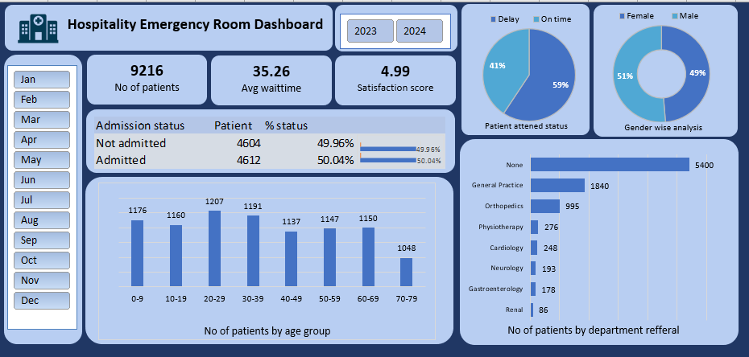

# Hospital_Emergency_Room_Analysis

##  Project Overview
This project is an **Excel-based Hospital Emergency Room Analysis Dashboard** that provides key insights into patient admissions, wait times, gender distribution and overall efficiency. The dashboard leverages **Power Query** for data transformation, **Power Pivot** for data modeling, and **Pivot Tables & Charts** for visualization.

---
##  Workflow & Process
### **Data Collection & Preparation**
- Gathered raw hospital emergency room data, including **patient admissions, waiting times, gender, and department referrals**.
- Ensured data consistency and cleaned missing or incorrect values.

### **Data Transformation (Power Query)**
- Cleaned and transformed the dataset.
- Created a **Calendar Table** to enable time-based analysis.

### **Data Modeling (Power Pivot)**
- Established relationships between tables.
- Used **DAX (Data Analysis Expressions)** for calculated fields where necessary.
- Optimized the data model for efficient analysis.

### **Dashboard Creation (Pivot Tables & Charts)**
- Created **KPIs** (Key Performance Indicators) such as:
- Developed visualizations, including:
- Applied **slicers and interactive filters** to enhance user experience.

### **Key Insights**

- Balanced patient admissions, with nearly equal admitted and non-admitted cases.
- Young adults (20-29 years) have the highest ER visits.
- Wait time delays exist, impacting patient satisfaction.
- Gender distribution is nearly equal (Male vs. Female).
- Most referrals go to General Practice, Orthopedics & Physiotherapy.
- Efficiency improvements needed in reducing delays and optimizing workflows.

  

